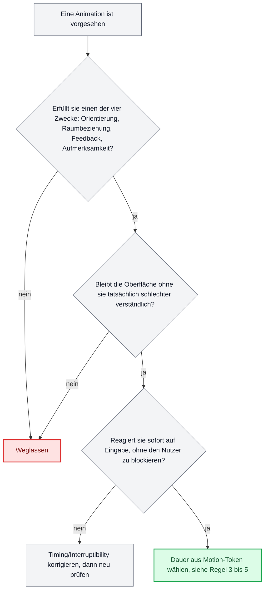

# Bewegung in Oberflächen

Diese Datei übersetzt die Lehre von Animation, die belegten Funktionen von Bewegung in Software und die Technik anspruchsvoller scrollgesteuerter Effekte in prüfbare Regeln, nach denen ein Sprachmodell entscheiden kann, ob eine Animation überhaupt hingehört, wie lange sie dauert, und wie sie gebaut wird. Jede Zahl und jede Kurve trägt ihre Quelle, jeder Punkt ohne belastbare Quelle ist als ungeprüft gekennzeichnet.

## Inhalt

- 1. Die zwölf Prinzipien, ehrlich sortiert
- 2. Zweck vor Zierde
- 3. Dauern und Kurven
- 4. Barrierefreiheit
- 5. Scrollgesteuerte Choreografie, technisch
- 6. Bewegungs-Tokens
- 7. Übersetzung in Regeln
- Quellenverzeichnis

## 1. Die zwölf Prinzipien, ehrlich sortiert

Frank Thomas und Ollie Johnston beschreiben in „The Illusion of Life" (Disney Editions, 1981) zwölf Prinzipien, die die Zeichentrickabteilung von Disney für glaubwürdige, gezeichnete Bewegung entwickelt hatte: Squash and Stretch, Anticipation, Staging, Straight Ahead Action und Pose to Pose, Follow Through und Overlapping Action, Slow In and Slow Out, Arcs, Secondary Action, Timing, Exaggeration, Solid Drawing, Appeal. Sie entstanden für gezeichnete Figuren auf einer Kinoleinwand, nicht für Flächen, die Nutzereingaben quittieren. Die naheliegende Annahme, ausdrucksstarke Prinzipien wie Timing und Anticipation seien für Interfaces brauchbar und körperliche Prinzipien wie Squash and Stretch seien es nicht, hält der Recherche nur zum Teil stand.

Val Head, die zu diesem Thema die einschlägige Fachliteratur für Interface-Design geschrieben hat („Designing Interface Animation", Rosenfeld Media, 2016), warnt ausdrücklich davor, die zwölf Prinzipien unbesehen zu übernehmen: „Not all of the 12 principles apply equally to work on the web or to modern tools." Ihre eigene Auswahl der nützlichen Prinzipien lautet wörtlich: „A solid understanding of Timing, Follow-through, Appeal, Anticipation and Squash and Stretch will be useful in web design." Als weitgehend irrelevant benennt sie „concepts like Staging and Solid Drawing" (Val Head, „What Does Disney Know About Interface Animation Anyway?", valhead.com, 18.01.2016).

Das ist bemerkenswert, weil es der verbreiteten Intuition widerspricht: Squash and Stretch steht bei ihr auf der nützlichen Seite, nicht auf der schädlichen. Head begründet das mit der sichtbaren Formveränderung selbst: „Squash and Stretch shows how manipulating the shape of an object can suggest traits about the material it's made of" (Val Head, „What Does Disney Know About Interface Animation Anyway?", valhead.com, 18.01.2016). Genau umgekehrt liegt der Fall bei Staging und Solid Drawing: Beide setzen eine Kamera, eine Bühne und eine gezeichnete Volumenform voraus, für die es in einer flachen, kompositierten Oberfläche kein Äquivalent gibt, deshalb bleiben sie irrelevant.

Für die übrigen Prinzipien (Straight Ahead vs. Pose to Pose, Arcs, Secondary Action, Exaggeration) fand sich in der geprüften Literatur keine explizite Einzelbewertung; das ist hier ausdrücklich als Lücke markiert, keine erfundene Einordnung. Nach der Logik von Zweck vor Zierde (Abschnitt 2) lässt sich nur so viel sagen, ohne eine neue Quelle zu behaupten: Arcs (Bewegung entlang gekrümmter statt linearer Bahnen) und Secondary Action (eine begleitende Nebenbewegung, die die Hauptaussage stützt) sind mit dem Prinzip Follow Through verwandt und dort mitgemeint, wo Head Follow Through nennt. Exaggeration (das bewusste Übertreiben einer Bewegung, um sie lesbarer zu machen) widerspricht dagegen direkt Apples und Carbons Grundsatz kurzer, unaufdringlicher Übergänge (Abschnitt 3) und gehört in Produktoberflächen nicht eingesetzt, außer in bewusst spielerischen Erfolgsmomenten.

IBM Carbon und Material Design nehmen in ihrer offiziellen Dokumentation keinen Bezug auf die zwölf Prinzipien. Carbon formuliert das Slow-In/Slow-Out-Prinzip in eigenen Worten, ohne Thomas und Johnston zu nennen: „Strictly linear movement appears unnatural to the human eye"; Elemente sollen sich beschleunigen und sanft abbremsen, „obeying the physics of a light-weight material" (carbondesignsystem.com/elements/motion/overview/). Zu einer Bewertung durch die Nielsen Norman Group und zu einer zitierfähigen Primärquelle von Rachel Nabors ließ sich in dieser Recherche kein Volltext auffinden; beide Punkte gelten hier als ungeprüft.

## 2. Zweck vor Zierde

Material Design nennt vier Funktionen von Bewegung direkt und offiziell: Motion „informs users by highlighting relationships between elements, action availability, and action outcomes"; „helps orient users by showing how elements in a transition are related"; „provides timely feedback and indicates the status of user or system actions"; „focuses attention on what's important, without creating unnecessary distraction" (m2.material.io/design/motion/understanding-motion.html). Das deckt die vier gesuchten Funktionen ab: Orientierung bei Zustandswechseln, räumliche Beziehung zwischen Ansichten, Rückmeldung auf Eingabe, Aufmerksamkeitslenkung. IBM Carbon formuliert es funktional ähnlich: Motion könne „bring the screen to life, guide users through complex experiences, and help move them forward", und unterscheidet produktive Bewegung (schnell, aufgabenorientiert) von expressiver Bewegung, die für „occasional, important moments" reserviert bleiben soll (carbondesignsystem.com/elements/motion/overview/).

Die Gegenprobe, woran man Selbstzweck erkennt, ist ebenfalls belegt, und deutlich schärfer formuliert als die Funktionsliste selbst. Apple schreibt in den Human Interface Guidelines: „Don't add motion for the sake of adding motion. Gratuitous or excessive animation can distract people and may make them feel disconnected or physically uncomfortable" (developer.apple.com/design/human-interface-guidelines/motion). Val Head macht daraus eine Prüfregel: „All UI animations need to have a defined purpose tied to a design outcome", und warnt, dass reine Delight-Animation das Gegenteil bewirkt: „An animation that you add solely to increase delight usually does exactly the opposite from the user's perspective." Ihre Ergänzung betrifft Reaktionsfähigkeit statt Ausdruck: Eine Animation darf den Nutzer nie blockieren, sie muss „always feel responsive to a user's input, even if the animation is currently animating" (uxmatters.com/mt/archives/2016/12/designing-interface-animation.php).

Daraus folgt eine prüfbare Kette für jede einzelne Animation in einem Entwurf: Lässt sich benennen, welchen der vier Zwecke (Orientierung, Raum, Feedback, Aufmerksamkeit) sie erfüllt? Bleibt die Oberfläche ohne sie tatsächlich schlechter verständlich, oder wurde die Bewegung nur ergänzt, weil eine leere Stelle im Entwurf „noch nicht fertig" wirkte? Reagiert sie sofort auf Eingabe, oder zwingt sie zum Warten? Wer diese drei Fragen nicht mit Ja beantworten kann, hat eine Zieranimation vor sich, keine Funktionsanimation.

## 3. Dauern und Kurven

### 3.1 Die drei Systeme im Vergleich

| System | Kürzeste Dauer | Typische Standardübergänge | Längste dokumentierte Dauer | Bounce/Elastic im System |
|---|---|---|---|---|
| Material Design 3 | 50 ms (short1) | 200 bis 400 ms (short4 bis medium) | 1000 ms (extra-long4) | Nein, nicht im Easing-Set enthalten |
| Apple HIG | nicht spezifiziert | nicht spezifiziert, nur „brief" gefordert | nicht spezifiziert | Nein im festen Kurvensystem, aber technisch als Federüberschwingen (`bounce`-Parameter) möglich |
| IBM Carbon | 70 ms (fast-01) | 150 bis 240 ms (moderate-01/02) | 700 ms (slow-02) | Explizit ausgeschlossen |

Material Design 3 dokumentiert Dauer-Tokens in vier Stufen zu je vier Substufen: short1 bis short4 (50, 100, 150, 200 ms), medium1 bis medium4 (250, 300, 350, 400 ms), long1 bis long4 (450, 500, 550, 600 ms), extra-long1 bis extra-long4 (700, 800, 900, 1000 ms). Easing-Tokens: Standard `cubic-bezier(0.2, 0, 0, 1)`, Standard Decelerate `cubic-bezier(0, 0, 0, 1)`, Standard Accelerate `cubic-bezier(0.3, 0, 1, 1)`, Emphasized Decelerate `cubic-bezier(0.05, 0.7, 0.1, 1)`, Emphasized Accelerate `cubic-bezier(0.3, 0, 0.8, 0.15)` (m3.material.io/styles/motion/easing-and-duration/tokens-specs). Für die Grundkurve „Emphasized" selbst gibt Material keine einzelne, eindeutige Bezier-Zahl an, sondern einen mehrsegmentigen Spline; Web-Implementierungen nähern sie üblicherweise mit `cubic-bezier(0.2, 0, 0, 1)` an. Das ist ausdrücklich eine Näherung, keine offizielle Einzelzahl.

IBM Carbon dokumentiert im offiziellen Repository (carbon-design-system/carbon, packages/motion/src/dtcg/motion.json) sechs Dauer-Tokens: fast-01 (70 ms), fast-02 (110 ms), moderate-01 (150 ms), moderate-02 (240 ms), slow-01 (400 ms), slow-02 (700 ms), gestaffelt nach Element- und Distanzgröße. Easing liegt in Paaren aus productive und expressive vor: Standard productive `cubic-bezier(0.2, 0, 0.38, 0.9)`, Standard expressive `cubic-bezier(0.4, 0.14, 0.3, 1)`, Entrance productive `cubic-bezier(0, 0, 0.38, 0.9)`, Entrance expressive `cubic-bezier(0, 0, 0.3, 1)`, Exit productive `cubic-bezier(0.2, 0, 1, 0.9)`, Exit expressive `cubic-bezier(0.4, 0.14, 1, 1)` (carbondesignsystem.com/elements/motion). Carbon schließt Überschwingen ausdrücklich aus: „Avoid easing curves that are unnatural, distracting, or purely decorative … do not use easing curves that suggest bounce, stretch, or sudden stops."

Apples Human Interface Guidelines (developer.apple.com/design/human-interface-guidelines/motion) enthalten weder ms-Werte noch benannte Bezier-Kurven; das ist keine Recherchelücke, sondern die tatsächliche Spezifikationslage. Apple formuliert stattdessen Prinzipien: „Aim for brevity and precision in feedback animations", „In apps, generally avoid adding motion to UI interactions that occur frequently", „Make motion optional." Apple ist damit bewusst vager als Material und Carbon, nicht nachlässiger; die Plattform verlagert die konkrete Zahl auf die Implementierungsebene.

### 3.2 Warum Bounce und Elastic in Produktoberflächen fast immer falsch sind

Zwei von drei geprüften Systemen schließen überschwingende Kurven ausdrücklich aus ihrem Standard-Easing-Set aus (Carbon direkt im Wortlaut, Material 3 durch schlichtes Fehlen einer solchen Kurve im offiziellen Token-Satz). Val Head liefert die Begründung: Ein Richtungswechsel in der Bewegung (das Überschwingen und Zurückfedern bei Bounce/Elastic) trägt zusätzliche visuelle Information, die gelesen werden muss, und braucht deshalb tendenziell mehr Zeit, um lesbar statt hektisch zu wirken. Das widerspricht dem Ziel schneller, häufig wiederholter Microinteractions. Sie ordnet ausgeprägtes Squash-and-Stretch beziehungsweise Bounce eher einer spielerischen Markenpersönlichkeit zu, ihr eigenes Beispiel: „probably not the personality for a bank, but could be for a game" (Designing Interface Animation). Für seltene, bewusst gefeierte Erfolgsmomente in einem ansonsten sachlichen Produkt bleibt eine überschwingende Kurve damit vertretbar, als Standardkurve für Übergänge, Ladezustände oder Formularfeedback nicht.

### 3.3 Federmodelle gegen feste Dauer

Apple bevorzugt bei interaktiven, gestengetriebenen Animationen dokumentiert Federmodelle statt fester Dauer-Kurven-Paare. `SwiftUI.Animation.interactiveSpring(response:dampingFraction:blendDuration:)` hat die Default-Werte response = 0,15, dampingFraction = 0,86, blendDuration = 0,25 und ist laut Apple „intended for driving interactive animations" (developer.apple.com/documentation). UIKit bietet dieselbe Idee über `UISpringTimingParameters` (mass, stiffness, damping, initialVelocity). Die Begründung liefert die WWDC-2018-Session „Designing Fluid Interfaces" (Session 803): Federn seien „inherently interruptible and velocity-aware", jede Animation solle jederzeit unterbrechbar und umkehrbar sein, was bei fingergesteuerten Gesten (Ziehen, Loslassen, erneutes Greifen mitten in der Bewegung) technisch nötig ist, weil eine feste Zeitkurve an einer beliebigen Stelle unterbrochen unnatürlich wirkt.

Material Design 3 und IBM Carbon setzen dagegen primär auf feste kubische Bezier-Kurven mit festen Dauern. Material nennt Unterbrechbarkeit zwar als Prinzip, die dokumentierten Tokens selbst bleiben aber Dauer-Kurve-Paare, keine Federparameter; Carbon erwähnt Federmodelle in der offiziellen Motion-Dokumentation nicht. Die praktische Regel daraus: Feste Kurven eignen sich für Zustandswechsel, die die Oberfläche selbst auslöst (Öffnen, Schließen, Einblenden); Federmodelle eignen sich, sobald eine Fingergeste oder ein Ziehvorgang mitten in der Bewegung unterbrochen werden können muss.

## 4. Barrierefreiheit

### 4.1 `prefers-reduced-motion`

`prefers-reduced-motion` ist eine User-Preference-Media-Query der W3C Media Queries Level 5 (w3.org/TR/mediaqueries-5), mit den Werten `no-preference` und `reduce`. Sie liest ausschließlich eine Betriebssystemeinstellung aus, es gibt kein eigenes Browser-UI dafür: macOS „Bedienungshilfen > Anzeige > Bewegung reduzieren", Windows „Animationseffekte anzeigen" (Bedienungshilfen), Android „Animationen entfernen" (seit Android 9), iOS „Bewegung reduzieren", GNOME „Reduce animation", KDE „Animation speed: Instant". Für serverseitiges Rendering existiert zusätzlich der HTTP-Client-Hint `Sec-CH-Prefers-Reduced-Motion`. Laut MDN Browser-Kompatibilitätsdaten wird die Media Query seit Chrome 76, Firefox 63, Safari 12.1 und Edge 79 unterstützt und gilt seit Januar 2020 als „widely available" (developer.mozilla.org/en-US/docs/Web/CSS/@media/prefers-reduced-motion).

### 4.2 WCAG 2.3.3, 2.2.2 und 2.3.1

**WCAG 2.3.3 „Animation from Interactions" (Level AAA)**: Durch Interaktion ausgelöste Bewegungsanimation muss deaktivierbar sein, außer sie ist essenziell für Funktion oder vermittelte Information. Der Zweck ist Schutz vor Schwindel, Übelkeit und Kopfschmerzen bei vestibulären Störungen; als konforme Technik nennt das Understanding-Dokument unter anderem die Berücksichtigung von `prefers-reduced-motion` (w3.org/WAI/WCAG21/Understanding/animation-from-interactions.html).

**WCAG 2.2.2 „Pause, Stop, Hide" (Level A)**: Gilt für Inhalt, der automatisch startet, länger als fünf Sekunden bewegt, blinkt oder scrollt, und parallel zu anderem Inhalt angezeigt wird. Für solchen Inhalt muss ein Mechanismus zum Pausieren, Stoppen oder Ausblenden existieren, bei automatisch aktualisierendem Inhalt ersatzweise eine Frequenzkontrolle, außer die Bewegung ist für die Aktivität essenziell (w3.org/WAI/WCAG21/Understanding/pause-stop-hide.html).

**WCAG 2.3.1 „Three Flashes or Below Threshold" (Level A)**: Kein Inhalt darf häufiger als dreimal pro Sekunde aufblitzen, außer unterhalb der definierten General-Flash- und Red-Flash-Schwellwerte; Schutz vor fotosensitiven Anfällen (w3.org/WAI/WCAG21/Understanding/three-flashes-or-below-threshold.html).

### 4.3 Vestibuläre Auslöser

Val Head benennt in „Designing Safer Web Animation for Motion Sensitivity" (A List Apart, 08.09.2015) konkrete Risikofaktoren: Bewegungen, die ein Objekt über eine große Fläche verschieben, gelten als „most apt to trigger a negative response"; übertriebenes Parallax-Scrolling und Scrolljacking, besonders bei unterschiedlicher Geschwindigkeit von Vorder- und Hintergrund; große virtuelle Zoom- oder Distanzsprünge. Vergleichsweise unbedenklich gelten Opacity-, Farb- und Weichzeichnereffekte. Grundlage des Mechanismus liefert eine peer-reviewte Arbeit: J. J. LaViola Jr., „A Discussion of Cybersickness in Virtual Environments", ACM SIGCHI Bulletin, 2000. Nach der dort beschriebenen Sensory-Conflict-Theorie korreliert Vektion (die visuell erzeugte Illusion von Eigenbewegung) mit großem Sichtfeld und schnellen Szenenwechseln als Auslöser visuell induzierter Bewegungskrankheit.

### 4.4 Ein reduzierter Zustand, der kein kaputter Zustand ist

MDNs eigenes Referenzbeispiel für `prefers-reduced-motion: reduce` ersetzt eine skalierende Transform-Animation („pulse") durch eine reine Opacity-Animation („dissolve"); die implizite Empfehlung lautet also: große Transform-, Translations- oder Skalierungsbewegung durch Fade-Übergänge ersetzen, nicht ersatzlos streichen. Eine pauschale Regel wie „alle Animation-Properties per Media Query auf `none` setzen" ist in keiner der geprüften offiziellen Quellen (MDN, W3C) explizit belegt; sie ist in der Praxis riskant, weil sie auch Zustandswechsel unsichtbar machen kann, die selbst gar keine vestibuläre Gefahr darstellen (etwa ein reines Fade-in beim Laden). Die belastbare Regel lautet deshalb enger: große Ortsveränderung, Parallaxe, Zoom und Autoplay-Bewegung abschalten oder auf Opacity reduzieren; Zustandsänderung, Fokus und Fehlermeldung weiter sichtbar machen, nur ohne die räumliche Verschiebung.

## 5. Scrollgesteuerte Choreografie, technisch

### 5.1 Native CSS-Scroll-Animationen

Die Spezifikation „CSS Scroll-driven Animations" (`animation-timeline`, `scroll()`, `view()`, dazu `scroll-timeline`, `view-timeline`, `timeline-scope`, `animation-range`) ist ein Working Draft der W3C CSS Working Group (drafts.csswg.org/scroll-animations-1), noch nicht final verabschiedet. Der Browser-Stand, Anfang September 2026 geprüft: Chrome und Edge unterstützen es seit Version 115 (Juli 2023) vollständig und ungeflaggt; Safari seit Version 26.0 (September 2025), inklusive `animation-range` und der Range-Start/End-Properties (webkit.org/blog/17101, webkit.org/blog/17333). Firefox liegt zurück: Laut caniuse.com wird `animation-timeline` erst ab Firefox 158 unterstützt, die aktuelle Stable-Version Anfang September 2026 ist jedoch 155/156 (endoflife.date/firefox). Firefox unterstützt native Scroll-Animationen in Stable damit zum Stand dieser Recherche noch nicht; MDN führt `animation-timeline` deshalb konsequent als „Limited availability, not Baseline".

Was damit ohne jede Zeile JavaScript geht: eine CSS-Eigenschaft, deren Fortschritt linear an die Scrollposition eines Containers (`scroll()`) oder an die Sichtbarkeit eines Elements im Viewport (`view()`) gekoppelt ist, ausgeführt auf dem Compositor-Thread, ohne Hauptthread-Blockierung. Was damit nicht geht, im Vergleich zu einer JS-Bibliothek: keine JavaScript-Hooks oder Callbacks bei bestimmten Scrollpositionen, keine Steuerung über die Web Animations API während der laufenden Animation, kein verzögerter „Lag"-Scrub mit Glättung, keine mehrstufige Pinning-Choreografie über mehrere Abschnitte mit benannten Zeitmarken, kein natives Muster für horizontale Scroll-Abschnitte, und nur eingeschränktes DevTools-Debugging. Für eine einfache, lineare Fortschrittsanimation (Progress-Bar, Fade-in beim Erscheinen, einfache Parallaxe eines einzelnen Elements) ist die native Lösung die richtige Wahl, sobald Chrome, Edge und Safari das Zielpublikum abdecken und ein CSS-Fallback für Firefox über `@supports not (animation-timeline: scroll())` vorgesehen ist. Für mehrstufige Choreografien mit Pinning über mehrere Abschnitte bleibt eine JS-Bibliothek nötig.

### 5.2 GSAP und ScrollTrigger, aktuelle Lizenzlage

Webflow übernahm GreenSock/GSAP im Oktober 2024. Mit dem Release GSAP 3.13 am 29./30. April 2025 wurden sämtliche zuvor kostenpflichtigen „Club GreenSock"-Plugins vollständig in das öffentliche GitHub-Repository und npm-Paket überführt: SplitText, MorphSVG, DrawSVG, ScrambleText, Physics2D beziehungsweise Inertia und ScrollSmoother. ScrollTrigger, Draggable und MotionPathPlugin waren dagegen schon vor GSAP 3.13 kostenlos. Club GreenSock als Mitgliedschaftsprogramm wurde eingestellt (gsap.com/blog/3-13). Die aktuelle „Standard License" (gsap.com/community/standard-license, wirksam seit 30.04.2025, zuletzt geändert 30.05.2025) erlaubt Implementierung und Nutzung der GSAP-Produkte „on any website, web application, or digital interface by any person or entity", ausdrücklich einschließlich kommerzieller Projekte und bezahlter Kundenarbeit, ohne separate Bezahlstufe und ohne Attributionspflicht. Die einzige dokumentierte Einschränkung: GSAP darf nicht innerhalb code-freier visueller Animations-Baukästen eingesetzt werden, die mit Webflows eigenem visuellen Animationseditor konkurrieren. **ScrollTrigger ist damit vollständiger Teil des kostenlosen Kerns**, ohne separate Bezahlversion.

### 5.3 Pinning, Scrubbing, Zeitleisten

Nach der offiziellen ScrollTrigger-Dokumentation (gsap.com/docs/v3/Plugins/ScrollTrigger): **Pin** fixiert ein Element per `position: fixed`, solange die zugeordnete ScrollTrigger-Phase aktiv ist; ein automatisch erzeugter „Pin-Spacer" hält den Platz im Dokumentfluss frei, während der restliche Inhalt darunter weiterscrollt. **Scrub** koppelt den Animationsfortschritt direkt an die Scrollbar-Position statt an Zeit, wie ein Video-Scrubber; `scrub: true` bedeutet 1:1-Kopplung, ein numerischer Wert wie `scrub: 1` fügt eine Sekunde Nachlauf zwischen Scrollposition und Animations-Playhead ein und glättet ruckartiges Scrollen. Eine **Timeline** bündelt mehrere Tweens sequenziell und lässt sich als Ganzes an einen ScrollTrigger binden, inklusive benannter Zeitmarken über `addLabel`, wodurch eine mehrstufige Choreografie über mehrere Abschnitte hinweg entsteht, deren Segmentanteile sich an der Gesamtdauer der Timeline orientieren.

### 5.4 Zerlegungs-Animationen (Explosionsdarstellung)

| Bauweise | Aufwand | Dateigröße/Performance | Wann geeignet |
|---|---|---|---|
| CSS-Transform-Ketten | Gering bis mittel: Ebenen (div je Bauteil) werden per `transform` auseinanderbewegt, gesteuert nativ über `animation-timeline`/`scroll()` oder über GSAP ScrollTrigger mit `scrub`. Keine 3D- oder Illustrationskenntnisse nötig. | Sehr klein, nur die Teil-Grafiken selbst; bei GSAP zusätzlich Core plus ScrollTrigger, zusammen wenige Dutzend KB. Läuft auf dem Compositor-Thread, GPU-Last minimal. | Flache oder 2D-artige Produktdarstellungen, Icons, schematische Diagramme mit wenigen Ebenen. |
| SVG-Gruppen | Mittel: Vektor-Illustration nötig, damit jedes Bauteil als eigene, sauber verankerte `<g>`-Gruppe vorliegt (Transform-Attribute vererben sich laut MDN an die Kindelemente); die eigentliche Steuerung danach simpel. | Sehr klein, da Vektor, verlustfrei skalierbar. | Icons, Diagramme, Infografiken, illustrative statt fotorealistische Produktdarstellungen. |
| 3D-Modell mit getrennten Teilen | Hoch: 3D-Modellierung, Aufteilung in benannte Nodes, Kamera- und Lichtsetup, WebGL-Rendering-Pipeline (Three.js, React Three Fiber oder Babylon.js, glTF-Format). Der `GLTFLoader` liefert laut Three.js-Dokumentation eine `THREE.Group` als `gltf.scene`, deren Kind-Meshes einzeln animierbar sind. | Stark variabel; keine belastbare Zahl für einfache Produktmodelle gefunden. Belegt ist nur: Charaktermodelle mit rund 30.000 Dreiecken und 2K-Textur liegen unkomprimiert bei 5 bis 15 MB, mit Draco-/Meshopt-Kompression und KTX2-Texturen sind 10 bis 70 Prozent Reduktion erreichbar. Erfordert aktiven WebGL-Kontext und GPU. | Echte 3D-Produkte, Technik- und Maschinenbau-Storytelling, High-End-Markenauftritte. |
| Bildsequenz | Hoch in der Produktion: typischerweise 60 bis 150 vorgerenderte Frames aus einer 3D-Renderfarm oder einem Fotostudio; die technische Umsetzung selbst ist einfach (Frame-Index aus Scroll-Fortschritt, `drawImage` auf Canvas, oft mit GSAP-Scrub und Pinning kombiniert). | Kann sehr groß werden bei vielen hochauflösigen Frames; Optimierung über WebP/AVIF, Sprite-Sheets und Lazy-Loading einzelner Frames nötig. | Fotorealistische Produktpräsentation, das bekannte „Apple-Produktseiten"-Muster (technisch beschrieben bei CSS-Tricks, „Let's Make One of Those Fancy Scrolling Animations Used on Apple Product Pages"). |

Empfehlung aus dieser Tabelle: Für schematische oder illustrative Zerlegung sind CSS-Ketten oder SVG-Gruppen fast immer die richtige Wahl, weil sie klein, performant und ohne Spezialwerkzeug baubar sind. Ein echtes 3D-Modell lohnt sich nur, wenn Rotation und freie Kamerafahrt Teil der Aussage sind, nicht nur die Zerlegung selbst; sonst liefert eine vorgerenderte Bildsequenz dasselbe fotorealistische Ergebnis mit geringerem Laufzeitrisiko, erkauft mit einem aufwendigeren, einmaligen Produktionsschritt.

### 5.5 Beeindruckende Hintergrundinteraktion

Zeigerreaktion, Verzerrung unter dem Zeiger, Partikelsysteme und WebGL-Hintergründe mit Eingabekopplung beruhen technisch auf denselben MDN-dokumentierten Bausteinen: der Pointer-Events-API zur Zeigerverfolgung, `<canvas>` beziehungsweise WebGL für Partikel und Shader, sowie Uniforms im Fragment-Shader, die die Zeigerposition an den Shader übergeben, um lokale Verzerrung zu erzeugen (dokumentiertes Muster etwa bei Codrops, „Creating a Bulge Distortion Effect with WebGL"; das ist Fachartikel-Ebene, keine Spezifikation).

Vertretbar in Produktoberflächen sind lokal begrenzte, cursor-gekoppelte Mikroeffekte auf einzelnen Elementen wie Buttons oder Karten, weil sie meist nur bei Interaktion aktiv sind. Kritisch ist der Fullscreen-WebGL-Shader-Hintergrund im Dauerbetrieb: Jeder Bildschirmpixel wird pro Frame neu berechnet (hohe Pixel-Fill-Rate), typischerweise in einer `requestAnimationFrame`-Dauerschleife, was auf Mobilgeräten GPU-Last und Akkuverbrauch spürbar erhöht. MDN dokumentiert offiziell, dass `requestAnimationFrame` in Hintergrund-Tabs und verdeckten iframes automatisch pausiert (developer.mozilla.org/en-US/docs/Web/API/Window/requestAnimationFrame); dasselbe Prinzip lässt sich mit der Intersection Observer API gezielt erweitern, um Effekte außerhalb des sichtbaren Viewports ebenfalls zu pausieren. Dekorative WebGL-Effekte sollten außerdem `prefers-reduced-motion` respektieren, auch wenn diese Übertragung von der klassischen UI-Animation auf Shader-Hintergründe in den geprüften Quellen nur implizit, nicht mit einem wörtlichen Zitat speziell zu WebGL, belegt ist.

## 6. Bewegungs-Tokens

Material Design 3 dokumentiert Easing und Dauer offiziell als benanntes Token-System, analog zu Farb- und Abstands-Tokens: `md.sys.motion.easing.standard` und `md.sys.motion.easing.emphasized` (jeweils mit `.accelerate`- und `.decelerate`-Varianten) sowie die in Abschnitt 3.1 genannten Dauer-Stufen, mit Implementierungen für Android, CSS, Flutter, iOS und After Effects (m3.material.io/styles/motion/easing-and-duration/tokens-specs). IBM Carbon dokumentiert dieselbe Idee als `duration-fast-01` bis `duration-slow-02`, gestaffelt nach Element- und Distanzgröße, kombiniert mit den drei Easing-Typen Standard, Entrance und Exit in je einer productive- und einer expressive-Variante (carbondesignsystem.com/elements/motion). Das gemeinsame Prinzip: Eine Komponente wählt niemals eine eigene Millisekundenzahl oder eine frei erfundene Bezier-Kurve, sondern verweist auf einen benannten Token aus einem festen, kleinen Satz. Das hält Übergänge im gesamten Produkt konsistent und macht eine spätere globale Anpassung (etwa ein System, das insgesamt schneller wirken soll) zu einer Änderung an einer Stelle statt an hundert Komponenten.

## 7. Übersetzung in Regeln

1. **Ob überhaupt.** Eine Animation gehört nur hinein, wenn sie Orientierung, räumliche Beziehung, Rückmeldung oder Aufmerksamkeit trägt, und die Oberfläche ohne sie nachweisbar schlechter verständlich wäre. Quelle: Material Design, „Understanding motion" (m2.material.io/design/motion/understanding-motion.html); Apple HIG, Motion („Don't add motion for the sake of adding motion"); Val Head, „All UI animations need to have a defined purpose tied to a design outcome".

2. **Reaktionsfähigkeit vor Ausdruck.** Eine Animation darf eine Nutzereingabe nie blockieren; sie muss jederzeit unterbrechbar bleiben, besonders bei gestengetriebenen Interaktionen. Quelle: Val Head, Designing Interface Animation; Apple WWDC18 Session 803, „Designing Fluid Interfaces" (Federmodelle als „inherently interruptible and velocity-aware").

3. **Dauer aus Tokens, nicht aus dem Gefühl.** Für Zustandswechsel, die die Oberfläche selbst auslöst, feste Dauer-Kurve-Paare aus einem Token-System wählen, keine frei erfundene Millisekundenzahl. Kleine, häufige Übergänge (Hover, Toggle, kleine Ein-/Ausblendungen) im Bereich Carbon fast-01/fast-02 (70 bis 110 ms) oder Material short1 bis short3 (50 bis 150 ms); mittlere Übergänge (Panel, Dialog, Kartenwechsel) im Bereich Carbon moderate (150 bis 240 ms) oder Material medium (250 bis 400 ms); große, seltene Übergänge (Seitenwechsel, große Layoutverschiebung) im Bereich Material long bis extra-long (450 bis 1000 ms), Carbon dokumentiert dafür keinen eigenen Bereich über 700 ms. Quelle: Abschnitt 3.1 dieser Recherche, m3.material.io und carbondesignsystem.com.

4. **Federmodell statt fester Kurve bei Fingergesten.** Sobald ein Nutzer eine Bewegung per Ziehen, Wischen oder Loslassen mitten in der Animation unterbrechen können muss, ein physikbasiertes Federmodell verwenden (SwiftUI `interactiveSpring`, UIKit `UISpringTimingParameters`, oder ein äquivalentes JS-Federmodell), keine feste Bezier-Dauer. Quelle: Abschnitt 3.3.

5. **Kein Bounce, kein Elastic als Standardkurve.** Überschwingende Kurven nur für seltene, bewusst gefeierte Erfolgsmomente in einem ansonsten spielerischen Produktkontext, niemals als Standardübergang für Formulare, Navigation oder Ladezustände. Quelle: carbondesignsystem.com („do not use easing curves that suggest bounce, stretch, or sudden stops"); Val Head zur Markenpersönlichkeit von Squash-and-Stretch.

6. **`prefers-reduced-motion` immer respektieren, auch bei dekorativen Effekten.** Große Ortsveränderung, Parallaxe, Zoom und automatisch laufende Bewegung im reduzierten Zustand entfernen oder durch Opacity-Übergänge ersetzen; Zustandswechsel, Fokus und Fehlermeldung dabei sichtbar lassen, nicht pauschal alle Animation-Properties abschalten. Quelle: Abschnitt 4.1 und 4.4, MDN-Referenzbeispiel „pulse zu dissolve".

7. **Automatisch bewegter, blinkender oder scrollender Inhalt über fünf Sekunden braucht eine Pause-, Stopp- oder Ausblendfunktion**, außer die Bewegung ist für die Funktion essenziell. Quelle: WCAG 2.2.2, Abschnitt 4.2.

8. **Native CSS-Scroll-Animation für einfache, lineare Effekte, GSAP ScrollTrigger für mehrstufige Choreografie.** Ein einzelnes Element, dessen Fortschritt linear an Scrollposition oder Sichtbarkeit gekoppelt ist, mit `animation-timeline`/`scroll()`/`view()` bauen und einen CSS-Fallback für Firefox vorsehen; sobald Pinning über mehrere Abschnitte, Zeitmarken oder gedämpftes Scrubbing gebraucht werden, GSAP mit ScrollTrigger einsetzen, seit April 2025 vollständig kostenlos inklusive aller vormals kostenpflichtigen Plugins. Quelle: Abschnitt 5.1, 5.2.

9. **Zerlegungs-Animation nach Bildsprache wählen, nicht nach Beeindruckungsgrad.** Schematisch/illustrativ zuerst CSS-Ketten oder SVG-Gruppen prüfen; ein echtes 3D-Modell nur, wenn freie Kamerafahrt oder Rotation Teil der Aussage sind; fotorealistische Produktinszenierung über eine vorgerenderte Bildsequenz, nicht über Echtzeit-3D, wenn Ladezeit und Gerätestreuung ein Risiko sind. Quelle: Abschnitt 5.4.

10. **Dauerhaft laufende WebGL-Hintergründe außerhalb des Viewports pausieren.** `requestAnimationFrame`-Schleifen für dekorative Hintergrundeffekte an die Intersection Observer API koppeln, damit sie nur laufen, während das Element sichtbar ist; das gilt zusätzlich zur Reduced-Motion-Regel aus Punkt 6. Quelle: Abschnitt 5.5.

## Quellenverzeichnis

### Geprüft

- Frank Thomas, Ollie Johnston: „The Illusion of Life: Disney Animation", Disney Editions, 1981 (Standardwerk, zwölf Prinzipien der Animation)
- Val Head: „Designing Interface Animation: Meaningful Motion for User Experience", Rosenfeld Media, 26. Juli 2016; Verlagsseite [rosenfeldmedia.com/books/designing-interface-animation](https://rosenfeldmedia.com/books/designing-interface-animation/); Auszug via [uxmatters.com](https://www.uxmatters.com/mt/archives/2016/12/designing-interface-animation.php)
- Val Head: „What Does Disney Know About Interface Animation Anyway?", valhead.com, 18.01.2016, [valhead.com/2016/01/18/what-does-disney-know-about-interface-animation-anyway](https://valhead.com/2016/01/18/what-does-disney-know-about-interface-animation-anyway/)
- Val Head: „Designing Safer Web Animation for Motion Sensitivity", A List Apart, 08.09.2015, [alistapart.com/article/designing-safer-web-animation-for-motion-sensitivity](https://alistapart.com/article/designing-safer-web-animation-for-motion-sensitivity/)
- Google, Material Design: „Understanding motion" (M2), [m2.material.io/design/motion/understanding-motion.html](https://m2.material.io/design/motion/understanding-motion.html)
- Google, Material Design 3: „Motion, how it works", [m3.material.io/styles/motion/overview/how-it-works](https://m3.material.io/styles/motion/overview/how-it-works)
- Google, Material Design 3: „Easing and duration, tokens and specs", [m3.material.io/styles/motion/easing-and-duration/tokens-specs](https://m3.material.io/styles/motion/easing-and-duration/tokens-specs)
- Apple: „Human Interface Guidelines, Motion", [developer.apple.com/design/human-interface-guidelines/motion](https://developer.apple.com/design/human-interface-guidelines/motion)
- Apple: „interactiveSpring(response:dampingFraction:blendDuration:)", Apple Developer Documentation, [developer.apple.com/documentation/swiftui](https://developer.apple.com/documentation/swiftui/animation/interactivespring(response:dampingfraction:blendduration:))
- Apple: „UISpringTimingParameters", Apple Developer Documentation, [developer.apple.com/documentation/uikit/uispringtimingparameters](https://developer.apple.com/documentation/uikit/uispringtimingparameters)
- Apple: „Designing Fluid Interfaces", WWDC18 Session 803, [developer.apple.com/videos/play/wwdc2018/803](https://developer.apple.com/videos/play/wwdc2018/803/)
- IBM, Carbon Design System: „Motion, Overview", [carbondesignsystem.com/elements/motion/overview](https://carbondesignsystem.com/elements/motion/overview/)
- IBM, Carbon Design System, GitHub-Repository: `packages/motion/src/dtcg/motion.json`, [github.com/carbon-design-system/carbon](https://raw.githubusercontent.com/carbon-design-system/carbon/main/packages/motion/src/dtcg/motion.json)
- W3C: „Media Queries Level 5", Working Draft, [w3.org/TR/mediaqueries-5](https://www.w3.org/TR/mediaqueries-5/)
- MDN Web Docs: „prefers-reduced-motion", [developer.mozilla.org/en-US/docs/Web/CSS/@media/prefers-reduced-motion](https://developer.mozilla.org/en-US/docs/Web/CSS/@media/prefers-reduced-motion)
- W3C WAI: „Understanding SC 2.3.3, Animation from Interactions", [w3.org/WAI/WCAG21/Understanding/animation-from-interactions.html](https://www.w3.org/WAI/WCAG21/Understanding/animation-from-interactions.html)
- W3C WAI: „Understanding SC 2.2.2, Pause, Stop, Hide", [w3.org/WAI/WCAG21/Understanding/pause-stop-hide.html](https://www.w3.org/WAI/WCAG21/Understanding/pause-stop-hide.html)
- W3C WAI: „Understanding SC 2.3.1, Three Flashes or Below Threshold", [w3.org/WAI/WCAG21/Understanding/three-flashes-or-below-threshold.html](https://www.w3.org/WAI/WCAG21/Understanding/three-flashes-or-below-threshold.html)
- W3C WAI: „Technique C39, Using the CSS prefers-reduced-motion query", [w3.org/WAI/WCAG21/Techniques/css/C39](https://www.w3.org/WAI/WCAG21/Techniques/css/C39)
- J. J. LaViola Jr.: „A Discussion of Cybersickness in Virtual Environments", ACM SIGCHI Bulletin, 2000, DOI [10.1145/333329.333344](https://dl.acm.org/doi/10.1145/333329.333344), PDF [eecs.ucf.edu/~jjl/pubs/cybersick.pdf](https://www.eecs.ucf.edu/~jjl/pubs/cybersick.pdf)
- MDN Web Docs: „CSS scroll-driven animations", [developer.mozilla.org/en-US/docs/Web/CSS/Guides/Scroll-driven_animations](https://developer.mozilla.org/en-US/docs/Web/CSS/Guides/Scroll-driven_animations)
- MDN Web Docs: „animation-timeline", Browser-Kompatibilität, [developer.mozilla.org/en-US/docs/Web/CSS/animation-timeline](https://developer.mozilla.org/en-US/docs/Web/CSS/animation-timeline)
- caniuse.com: „animation-timeline", [caniuse.com/mdn-css_properties_animation-timeline](https://caniuse.com/mdn-css_properties_animation-timeline)
- endoflife.date: „Firefox", Versionsstand, [endoflife.date/firefox](https://endoflife.date/firefox)
- W3C CSSWG: „CSS Scroll-driven Animations", Working Draft, [drafts.csswg.org/scroll-animations-1](https://drafts.csswg.org/scroll-animations-1/)
- WebKit Blog: „A guide to Scroll-driven Animations with just CSS", [webkit.org/blog/17101](https://webkit.org/blog/17101/a-guide-to-scroll-driven-animations-with-just-css/)
- WebKit Blog: „WebKit Features in Safari 26.0", [webkit.org/blog/17333](https://webkit.org/blog/17333/webkit-features-in-safari-26-0/)
- GSAP/Webflow: „3.13 Release", offizieller Blogpost, [gsap.com/blog/3-13](https://gsap.com/blog/3-13/)
- GSAP: „Standard License", [gsap.com/community/standard-license](https://gsap.com/community/standard-license/)
- GSAP: „ScrollTrigger", offizielle Dokumentation, [gsap.com/docs/v3/Plugins/ScrollTrigger](https://gsap.com/docs/v3/Plugins/ScrollTrigger/)
- Three.js-Dokumentation: „GLTFLoader", [threejs.org/docs/pages/GLTFLoader.html](https://threejs.org/docs/pages/GLTFLoader.html)
- MDN Web Docs: „Window.requestAnimationFrame()", [developer.mozilla.org/en-US/docs/Web/API/Window/requestAnimationFrame](https://developer.mozilla.org/en-US/docs/Web/API/Window/requestAnimationFrame)
- MDN Web Docs: „Intersection Observer API", [developer.mozilla.org/en-US/docs/Web/API/Intersection_Observer_API](https://developer.mozilla.org/en-US/docs/Web/API/Intersection_Observer_API)
- MDN Web Docs: „Pointer Events", [developer.mozilla.org/en-US/docs/Web/API/Pointer_events](https://developer.mozilla.org/en-US/docs/Web/API/Pointer_events)

### Ungeprüft

- Einordnung der zwölf Prinzipien Straight Ahead vs. Pose to Pose, Arcs, Secondary Action und Exaggeration für UI-Kontexte: keine explizite Einzelbewertung in der geprüften Literatur gefunden, in Abschnitt 1 nur begründet abgeleitet, nicht zitiert
- Bewertung der zwölf Prinzipien durch die Nielsen Norman Group: kein zugänglicher Volltext gefunden
- Eine zitierfähige Primärquelle von Rachel Nabors zu UI-Motion: nicht aufgefunden
- Typische glTF-Dateigröße speziell für Explosions-/Produktdiagramme statt Charaktermodelle: keine belastbare Quelle, in Abschnitt 5.4 als Einschätzung, nicht als Zahl behandelt
- CSS-Tricks: „Let's Make One of Those Fancy Scrolling Animations Used on Apple Product Pages", [css-tricks.com](https://css-tricks.com/lets-make-one-of-those-fancy-scrolling-animations-used-on-apple-product-pages/) (technischer Fachartikel, kein Standardwerk, zur Bildsequenz-Technik in Abschnitt 5.4 herangezogen)
- Codrops: „Creating a Bulge Distortion Effect with WebGL", [tympanus.net/codrops](https://tympanus.net/codrops/2023/06/28/creating-a-bulge-distortion-effect-with-webgl/) (technischer Fachartikel, zur Distortion-Technik in Abschnitt 5.5 herangezogen)
- Übertragung der `prefers-reduced-motion`-Empfehlung auf dekorative WebGL-Hintergrundeffekte im Speziellen (Abschnitt 5.5): schlüssige Ableitung aus der allgemeinen MDN-Empfehlung, keine wörtliche WebGL-spezifische Quelle gefunden
