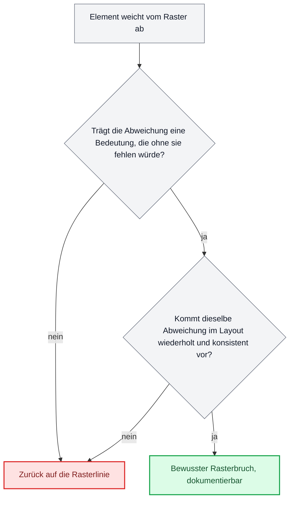

# Grundlagen der Gestaltungslehre

Diese Datei übersetzt akademisches Gestaltungswissen, Raster, Typografie, Farbe und Wahrnehmung, in prüfbare Regeln, die ein Sprachmodell beim Entwerfen einer Website oder Software-Oberfläche tatsächlich befolgen kann. Jede Regel in Abschnitt 5 trägt ihre Quelle, jeder Fund ist gegen ein Standardwerk, ein Hochschulcurriculum oder eine offizielle Norm geprüft.

## Inhalt

- 1. Raster und Komposition
- 2. Typografie
- 3. Farbe
- 4. Wahrnehmung
- 5. Übersetzung in Regeln
- 6. Anti-Muster
- 7. Quellenverzeichnis

## 1. Raster und Komposition

### Die Schweizer Schule

Josef Müller-Brockmann systematisierte in „Rastersysteme für die visuelle Gestaltung" (Niggli, 1981) den Raster als Ordnungsprinzip: eine Fläche wird in eine feste Zahl von Spalten und Zeilenfelder geteilt, an denen sich Text, Bild und Weißraum ausrichten. Das Buch enthält konkrete Rastersysteme von 8 bis 32 Feldern mit exakten Bauanleitungen, kein loses Stilideal. Die Schweizer Schule (auch: internationaler Stil) macht daraus eine Haltung: Gestaltung ist eine nachvollziehbare, wiederholbare Konstruktion, keine Geschmacksentscheidung im Einzelfall.

Vorläufer dieser Systematik liegt am Bauhaus: Johannes Ittens Vorkurs („Gestaltungs- und Formenlehre", 1963/1975, engl. „Design and Form", 1963) und später an der Hochschule für Gestaltung Ulm (1953 bis 1968). Dort entwickelten Tomás Maldonado, Otl Aicher und andere das „Ulmer Modell": Gestaltung als methodisch-wissenschaftlicher Prozess statt individueller Künstlerhandschrift, mit Bezügen zu Semiotik und Systemtheorie.

### Rastertypen

Ein Gestaltungsraster besteht aus drei Teilsystemen, die zusammen funktionieren: dem Spaltenraster (vertikale Teilung der Satzfläche), dem Baseline-Grid (horizontales Raster im Abstand der Grundschriftzeile, an dem alle Textzeilen einrasten) und dem modularen Raster (die Kombination beider Achsen zu quadratischen oder rechteckigen Modulen, an denen sich auch Bildgrößen ausrichten). Ein Element, das nicht auf einer Rasterlinie beginnt oder endet, bricht die Konstruktion sichtbar, selbst wenn der Unterschied nur wenige Pixel beträgt.

### Aktive und passive Fläche

In der Rastertradition wird zwischen bedruckter (aktiver) und leerer (passiver) Fläche unterschieden. Weißraum ist dabei kein Rest, sondern ein gestaltetes Element mit eigenem Gewicht: Er trennt Gruppen, schafft Ruhe und lenkt den Blick auf das, was übrig bleibt, wenn nicht jede Fläche gefüllt wird. Diese Unterscheidung ist Teil der Gestaltungsraster-Tradition, die auf Müller-Brockmann zurückgeht und in der deutschsprachigen Fachliteratur zum Rastersystem durchgängig beschrieben wird.

### Optischer Ausgleich

Mathematisch zentrierte oder bündige Elemente wirken für das Auge oft nicht ausgeglichen. Matthew Butterick beschreibt in „Practical Typography" (practicaltypography.com, seit 2013) das Prinzip des optischen Randausgleichs (hanging punctuation, optical margin alignment): Anführungszeichen, Aufzählungspunkte und runde Buchstabenformen werden geringfügig über die eigentliche Satzkante hinausgeschoben, weil sie sonst optisch eingerückt wirken. Dasselbe Prinzip gilt für vertikale Zentrierung von Icons neben Text: Die geometrische Mitte ist selten die optisch ruhige Mitte.

### Wann ein Raster gebrochen wird

Müller-Brockmann selbst behandelt die Abweichung vom Raster nicht als Fehler, sondern als Mittel, wenn sie einen Grund trägt: Betonung, Spannung, Hierarchiesprung. Der Unterschied zwischen einem gebrochenen Raster und einem fehlenden Raster ist die Absicht, mit der gebrochen wird, und ob die Abweichung im übrigen Layout konsequent wiederkehrt oder ein Einzelfall bleibt.

## 2. Typografie

### Schriftmischung

Ellen Lupton („Thinking with Type", Princeton Architectural Press, 2004) und Robert Bringhurst („The Elements of Typographic Style", Hartley & Marks, 1992) stimmen in einem Grundsatz überein: Zwei Schriften funktionieren zusammen, wenn sie sich klar unterscheiden (Serife gegen Grotesk, hohe gegen niedrige x-Höhe, schmal gegen breit), nicht wenn sie sich ähneln. Zwei sich ähnelnde Schriften lesen sich wie ein Fehler, nicht wie eine Entscheidung. In der Praxis genügen meist zwei Schriftfamilien, eine für Auszeichnung und Überschrift, eine für Fließtext.

### Typskala und ihre mathematische Herleitung

Bringhurst überträgt in „The Elements of Typographic Style" das Konzept der modularen Skala aus der Musik auf Schriftgrößen: eine Folge von Werten, die alle aus einer Basisgröße mit einem festen Verhältnis erzeugt werden (Basis × Verhältnis hoch n). Gebräuchliche Verhältnisse sind an musikalische Intervalle angelehnt, etwa die kleine Terz (1,2), die große Terz (1,25), die Quinte (1,5) oder der Goldene Schnitt (1,618). Eine Typskala ist damit nachrechenbar: Jede Stufe lässt sich aus Basisgröße und Verhältnis reproduzieren, beliebig gewählte Zwischengrößen fallen auf.

### Zeilenlänge, Zeilenabstand, Laufweite

Bringhurst nennt 45 bis 75 Zeichen pro Zeile als Zielbereich für Fließtext, mit 66 Zeichen als Mittelwert. Diese Faustregel deckt sich mit der empirischen Studie von Mary Dyson und Mark Haselgrove („The influence of reading speed and line length on the effectiveness of reading from screen", International Journal of Human-Computer Studies 54, 2001, S. 585 bis 612): Mittlere Zeilenlängen um 55 Zeichen unterstützten sowohl normales als auch schnelles Lesen am Bildschirm zuverlässig.

Für den Zeilenabstand (Durchschuss) wird in der typografischen Praxis, dokumentiert unter anderem bei Butterick (practicaltypography.com/line-spacing.html), ein Bereich von 120 bis 145 Prozent der Schriftgröße als Komfortzone für Fließtext angegeben. Diese Zahl ist eine praxiskonventionelle Faustregel, keine strikt experimentell hergeleitete Konstante, deshalb an dieser Stelle als **ungeprüft im engeren Sinn** markiert: breit dokumentiert, aber ohne eine einzelne belastbare Primärstudie mit genau diesem Prozentbereich.

Laufweite (Letterspacing) wird laut Butterick fast nie bei Fließtextgröße vergrößert, sondern höchstens bei sehr kleiner Schrift leicht geweitet und bei sehr großer Schrift (Headlines) leicht verengt, weil optische Wortzwischenräume mit der Schriftgröße nicht linear mitwachsen.

### Hierarchie ohne Fettung

Lupton und Bringhurst beschreiben Hierarchie als Zusammenspiel mehrerer Mittel, nicht als einzelner Schalter: Größe, Gewicht, Abstand, Position, Farbe und Laufweite lassen sich einzeln oder kombiniert einsetzen. Fettung ist nur eines von mehreren Werkzeugen; ein Text, der Hierarchie ausschließlich über Fett gegen Nicht-Fett herstellt, verschenkt die übrigen Achsen und wirkt bei mehr als zwei Ebenen grob.

### Mikrotypografie im Deutschen

Friedrich Forssman und Ralf de Jong dokumentieren in „Detailtypografie" (Verlag Hermann Schmidt, 8. Auflage, 408 Seiten) die Detailregeln des deutschen Schriftsatzes: doppelte Anführungszeichen unten und oben („so", nicht "so" in der Form geneigter Zeichen), einfache Anführungszeichen als ‚so' innerhalb von Zitaten, der Halbgeviertstrich (–) für Gedankenstrich, Streckenangaben und Parenthese, der Bindestrich (-) ausschließlich für Wortkopplungen, ein schmales geschütztes Leerzeichen vor Abkürzungen wie „z. B." und zwischen Zahl und Einheit („12 kg"), sowie das Divis ohne Leerzeichen bei zusammengesetzten Wörtern.

## 3. Farbe

### Farbräume: warum OKLCH und CIELAB HSL ablösen

HSL (Hue, Saturation, Lightness) baut auf dem RGB-Würfel auf und ist damit nicht wahrnehmungsgleich: Ein Lightness-Sprung von zehn Prozentpunkten wirkt bei dunklen Farbtönen deutlich stärker als bei hellen, und Farbtöne mit identischem HSL-Lightness-Wert erscheinen dem Auge unterschiedlich hell. Björn Ottosson stellte 2020 den Farbraum Oklab und seine zylindrische Form OKLCH vor, kalibriert unter anderem an den MacAdam-Ellipsen und dem Luo-Rigg-Datensatz zur menschlichen Farbunterscheidung. Seit Dezember 2021 ist OKLCH Teil der CSS-Color-Module-Level-4/5-Spezifikation und seit 2023 nativ in allen aktuellen Browsern verfügbar. In OKLCH und im älteren CIELAB (beide auf einem wahrnehmungsgleichen Raum aufgebaut) erzeugen gleiche Zahlenschritte auf der Helligkeitsachse annähernd gleich große wahrgenommene Helligkeitsschritte, in HSL nicht.

### Kontrastberechnung nach WCAG und ihre Schwächen

Der offizielle Maßstab ist WCAG 2.2, Erfolgskriterium 1.4.3 „Contrast (Minimum)" (W3C, w3.org/WAI/WCAG22/Understanding/contrast-minimum): Fließtext benötigt ein Kontrastverhältnis von mindestens 4,5 zu 1 gegenüber dem Hintergrund, große Schrift (ab 18 Punkt beziehungsweise 14 Punkt fett) mindestens 3 zu 1. Berechnete Werte werden nicht gerundet, 4,499 zu 1 erfüllt die Schwelle nicht.

Diese Formel hat eine bekannte Schwäche: Sie berücksichtigt weder Schriftschnitt noch Strichstärke, eine dünne und eine fette Schrift mit identischen Farbwerten gelten als gleich lesbar, obwohl sie es nicht sind. Als Alternative wird APCA (Advanced Perceptual Contrast Algorithm, dokumentiert unter git.apcacontrast.com) diskutiert, das im Silver-Prozess des W3C für eine künftige WCAG-3-Fassung geprüft wird, aber noch kein verabschiedeter Standard ist. Für den heutigen Entwurf bleibt WCAG 1.4.3 die verbindliche, prüfbare Schwelle, APCA liefert die genauere, aber noch nicht normative Zusatzprüfung.

### Farbharmonie

Johannes Itten beschreibt in „Kunst der Farbe" (Otto Maier Verlag, Ravensburg, 1961) sieben Farbkontraste: Farbe-an-sich-Kontrast, Hell-Dunkel-Kontrast, Kalt-Warm-Kontrast, Komplementärkontrast, Simultankontrast, Qualitätskontrast und Quantitätskontrast. Diese Systematik liefert kein einzelnes „richtiges" Farbschema, sondern ein Vokabular: Welcher Kontrast in einem Entwurf dominiert, ist eine Entscheidung, keine Standardeinstellung, und mehrere gleichzeitig voll ausgereizte Kontraste heben sich gegenseitig auf.

### Semantische gegen dekorative Farbe

Die Unterscheidung zwischen Farbe, die Bedeutung trägt (Status, Fehler, Erfolg), und Farbe, die nur schmückt, ist in der akademischen Gestaltungslehre nicht als eigener Begriff verankert, sie stammt überwiegend aus der Praxis moderner Designsysteme. Diese Einschränkung wird hier ausdrücklich benannt. Belastbar und offiziell geprüft ist dagegen die Konsequenz daraus: WCAG-Erfolgskriterium 1.4.1 „Use of Color" (Stufe A, w3.org/WAI/WCAG21/Understanding/use-of-color.html) verlangt, dass Farbe niemals das einzige Mittel ist, um Information zu vermitteln, eine Handlung anzuzeigen oder ein Element zu unterscheiden.

### Farbfehlsichtigkeit

Jennifer Birch fasst in „Worldwide prevalence of red-green color deficiency" (Journal of the Optical Society of America A, 29(3), 2012, S. 313 bis 320) die Populationsdaten zusammen: Bei Menschen europäischer Abstammung sind etwa 8 Prozent der Männer und etwa 0,4 Prozent der Frauen von einer Rot-Grün-Farbsehschwäche betroffen, mit Abweichungen bei anderen ethnischen Gruppen (4 bis 6,5 Prozent bei Männern chinesischer und japanischer Abstammung). Diese Häufigkeit macht Rot-Grün als alleinigen Bedeutungsträger in einer Oberfläche zu einem Fehler mit messbarer Betroffenenzahl, nicht zu einem theoretischen Randfall.

## 4. Wahrnehmung

### Gestaltgesetze

Max Wertheimer legte 1923 mit „Untersuchungen zur Lehre von der Gestalt II" (Psychologische Forschung 4, S. 301 bis 350) die Grundlage der Gestaltpsychologie. Sein zentraler Satz: Die Eigenschaften der Teile ergeben sich aus den Strukturgesetzen des Ganzen, nicht umgekehrt. Vier Ordnungsprinzipien aus dieser Arbeit sind für Gestaltung direkt nutzbar: Nähe (räumlich nahe Elemente werden als Gruppe wahrgenommen), Ähnlichkeit (Elemente mit gleicher Form, Farbe oder Größe werden als zusammengehörig gelesen), Geschlossenheit (das Auge ergänzt fehlende Teile zu einer vollständigen Figur) und Prägnanz (das Wahrnehmungssystem bevorzugt die einfachste, regelmäßigste Deutung einer Anordnung).

### Visuelle Hierarchie und Blickführung

Der MIT-Kurs 6.831 „User Interface Design and Implementation" (MIT OpenCourseWare, ocw.mit.edu) führt für die Prüfung von Bildschirmentwürfen den „Squint Test" ein: Wird der Entwurf unscharf betrachtet (Augen zusammenkneifen oder Bild verkleinern), muss die wichtigste Information weiterhin als hellster, größter oder kontrastreichster Fleck erkennbar bleiben. Der Test macht Hierarchie überprüfbar, ohne dass Formulierungen wie „wirkt geordnet" nötig sind: Was im Unscharfen verschwindet, trägt keine Priorität.

### Signal-Rausch-Verhältnis und kognitive Last

John Sweller begründet in „Cognitive Load During Problem Solving: Effects on Learning" (Cognitive Science 12, 1988, S. 257 bis 285) die Cognitive Load Theory. Die Dreiteilung der kognitiven Last in intrinsische Last (durch die Aufgabe selbst gegeben), extrane Last (durch schlechte Darstellung erzeugt, gestaltbar) und germane Last (für den Aufbau von Verständnis nötig) stammt aus Sweller, van Merriënboer und Paas, „Cognitive Architecture and Instructional Design" (Educational Psychology Review 10(3), 1998, S. 251 bis 296). Für Gestaltung folgt daraus unmittelbar: Jedes Element, das keine intrinsische oder germane Funktion trägt, erhöht ausschließlich die extrane Last und senkt damit das Signal-Rausch-Verhältnis der Seite, unabhängig davon, wie dekorativ es gemeint ist.

## 5. Übersetzung in Regeln

Jede Regel ist an einem fertigen Entwurf nachmessbar, nicht nur beurteilbar.

| Bereich | Regel | Nachweis am Entwurf | Quelle |
|---|---|---|---|
| Raster | Text- und Bildblöcke beginnen und enden auf denselben Spaltengrenzen eines festen Spaltenrasters (z. B. 12 Spalten). | Rasterlinien über den Entwurf legen, jede Kante prüfen. | Müller-Brockmann 1981 |
| Baseline | Alle vertikalen Abstände (Zeilenabstand, Absatzabstand, Blockabstand) sind ganzzahlige Vielfache einer Basiseinheit (z. B. 4 oder 8 px). | Jeden vertikalen Abstand durch die Basiseinheit teilen, Rest muss 0 sein. | Bringhurst 1992, Konzept des Baseline-Grid |
| Typskala | Schriftgrößen folgen Basis × Verhältnis^n mit festem Verhältnis, keine freihändig gewählten Zwischenwerte. | Jede vorkommende Schriftgröße gegen die Formel rechnen. | Bringhurst 1992 |
| Zeilenlänge | Fließtext hat 45 bis 75 Zeichen pro Zeile. | Zeichen pro Zeile in der breitesten und schmalsten Spalte zählen. | Bringhurst 1992; Dyson/Haselgrove 2001 |
| Schriftmischung | Höchstens zwei Schriftfamilien, die sich in Kategorie (Serife/Grotesk) oder x-Höhe klar unterscheiden. | Schriftfamilien im Entwurf auszählen und vergleichen. | Lupton 2004; Bringhurst 1992 |
| Hierarchie | Jede Hierarchieebene unterscheidet sich in mindestens zwei der Merkmale Größe, Gewicht, Abstand, Farbe, Position. | Merkmalsmatrix je Ebene aufstellen. | Lupton 2004 |
| Kontrast | Fließtext erreicht mindestens 4,5 zu 1, Großtext mindestens 3 zu 1 gegenüber dem Hintergrund. | Kontrastrechner auf jede Text-Hintergrund-Kombination anwenden. | WCAG 2.2, 1.4.3 |
| Farbcodierung | Keine Bedeutung hängt ausschließlich an einer Farbe, mindestens ein zweites Merkmal (Form, Text, Icon, Muster) trägt dieselbe Information. | Entwurf in Graustufen prüfen, ob Bedeutung erhalten bleibt. | WCAG 2.1, 1.4.1; Birch 2012 |
| Farbraum | Paletten und Verläufe werden in OKLCH oder CIELAB erzeugt, nicht in HSL. | Farbdefinitionen im Code prüfen. | Ottosson 2020 |
| Deutsche Mikrotypografie | Anführungszeichen als „so" und ‚so', Gedankenstrich als –, Bindestrich als - nur in Komposita. | Zeichen im Fließtext gegen die Liste prüfen. | Forssman/de Jong |
| Signal-Rausch | Jedes Element ohne intrinsische oder germane Funktion wird entfernt oder in Kontrast, Größe und Farbe deutlich zurückgenommen. | Elemente auflisten und Funktion je Element benennen. | Sweller, van Merriënboer, Paas 1998 |
| Gruppierung | Der Abstand innerhalb einer inhaltlichen Gruppe ist kleiner als der Abstand zu benachbarten, nicht zugehörigen Gruppen. | Abstände zwischen und innerhalb von Gruppen messen und vergleichen. | Wertheimer 1923, Prinzip der Nähe |
| Rasterbruch | Eine Abweichung vom Raster kommt im Entwurf mehrfach konsistent vor oder gar nicht. | Einzelfälle von wiederkehrenden Abweichungen unterscheiden. | Müller-Brockmann 1981 |

## 6. Anti-Muster

Typische Fehler, wenn eine Maschine ohne dieses Wissen entwirft, mit ihrer Ursache:

Beliebige Schriftgrößen ohne System (14, 15, 17, 19 Pixel nebeneinander) entstehen, weil jede Größe einzeln nach Augenmaß statt aus einer Formel wie Basis × Verhältnis^n gesetzt wird. Ohne Typskala lässt sich keine Größe gegen eine andere rechtfertigen.

Zentrierter Fließtext über mehrere Zeilen ignoriert, dass das Auge beim Zeilenwechsel eine feste linke Kante braucht, um die nächste Zeile zu finden. Zentrierung ist bei Überschriften und kurzen Einzeilern unproblematisch, bei Absätzen erzwingt sie bei jeder Zeile eine neue Suche nach dem Zeilenanfang.

Farbverläufe und Paletten in HSL erzeugen matschige, ungleich helle Zwischentöne, weil HSL keine wahrnehmungsgleiche Helligkeitsachse hat. Ein Verlauf von Blau zu Gelb über HSL-Interpolation läuft sichtbar durch einen grauen, entsättigten Bereich, den ein Verlauf über OKLCH nicht zeigt.

Status ausschließlich über Rot gegen Grün kodieren (Fehler gegen Erfolg) trifft, bei europäischer Bevölkerung, rund 8 Prozent der Männer, die diesen Unterschied nicht zuverlässig sehen. Die Ursache ist, ein Bedeutungspaar allein über einen einzigen Farbkanal zu transportieren, statt zusätzlich Form, Text oder Icon zu nutzen.

Text, der überall gleich groß, gleich fett und gleich weit auseinandersteht, hat keine Prägnanz und keine erkennbare Hauptaussage, weil keine der Hierarchieachsen (Größe, Gewicht, Abstand, Farbe, Position) variiert wird. Der Squint Test zeigt bei einem solchen Entwurf keinen erkennbaren Schwerpunkt.

Willkürliche Abstände (10, 13, 22, 18 Pixel im selben Entwurf) entstehen, weil jeder Abstand einzeln statt aus einer Basiseinheit abgeleitet wird. Ohne Baseline-Grid summieren sich kleine Abweichungen zu einem sichtbar unruhigen vertikalen Rhythmus.

Kontrastwerte knapp über der WCAG-Schwelle bei sehr dünnen Schriftschnitten bestehen die formale Prüfung, sind aber schwer lesbar, weil WCAG 1.4.3 die Strichstärke nicht berücksichtigt. Die Ursache liegt in der bekannten Schwäche der WCAG-Kontrastformel selbst, nicht nur in der Entscheidung des Entwerfenden.

Layoutelemente, die weder auf einem Raster liegen noch erkennbar bewusst davon abweichen, sind das Ergebnis, wenn Positionen einzeln statt aus einem gemeinsamen Rastersystem bestimmt werden. Das Ergebnis wirkt weder systematisch noch als Gestaltungsentscheidung erkennbar, weil beides ununterscheidbar ist, solange die Abweichung nicht wiederkehrt.

Falsche deutsche Anführungszeichen (typografisch geneigte "So" statt „So") und ein Bindestrich statt eines Gedankenstrichs für Parenthesen entstehen, weil viele Sprachmodelle standardmäßig englische Satzzeichen erzeugen und die deutschen Detailregeln aus Forssman/de Jong nicht als Vorgabe hinterlegt sind.

## 7. Quellenverzeichnis

### Geprüft

- Josef Müller-Brockmann: Rastersysteme für die visuelle Gestaltung / Grid Systems in Graphic Design. Niggli, 1981. ISBN 978-3-7212-0145-1.
- Ellen Lupton: Thinking with Type. Princeton Architectural Press, 2004 (2. Auflage 2010).
- Matthew Butterick: Practical Typography. Web-Buch, seit 2013. https://practicaltypography.com/
- Robert Bringhurst: The Elements of Typographic Style. Hartley & Marks, 1992 (4. Auflage 2012).
- Jan Tschichold: Die neue Typographie. Verlag des Bildungsverbandes der Deutschen Buchdrucker, Berlin, 1928; Jan Tschichold: Glaube und Wirklichkeit (Widerruf der eigenen Position), 1946.
- Friedrich Forssman, Ralf de Jong: Detailtypografie. Verlag Hermann Schmidt, Mainz, 8. Auflage.
- W3C: Web Content Accessibility Guidelines (WCAG) 2.2, Erfolgskriterium 1.4.3 Contrast (Minimum). https://www.w3.org/WAI/WCAG22/Understanding/contrast-minimum
- W3C: WCAG 2.1, Erfolgskriterium 1.4.1 Use of Color. https://www.w3.org/WAI/WCAG21/Understanding/use-of-color.html
- Björn Ottosson: Oklab- und OKLCH-Farbraum, 2020, seit Dezember 2021 Teil von CSS Color Module Level 4/5.
- ISO 9241-110:2006 (überarbeitet 2020): Ergonomics of human-system interaction, Part 110: Dialogue principles. https://www.iso.org/standard/38009.html
- Max Wertheimer: Untersuchungen zur Lehre von der Gestalt II. Psychologische Forschung, 4, 1923, S. 301 bis 350.
- John Sweller: Cognitive Load During Problem Solving: Effects on Learning. Cognitive Science, 12, 1988, S. 257 bis 285.
- John Sweller, Jeroen J. G. van Merriënboer, Fred G. W. C. Paas: Cognitive Architecture and Instructional Design. Educational Psychology Review, 10(3), 1998, S. 251 bis 296.
- Johannes Itten: Gestaltungs- und Formenlehre / Mein Vorkurs am Bauhaus, 1963/1975; englisch: Design and Form: The Basic Course at the Bauhaus, 1963.
- Johannes Itten: Kunst der Farbe. Otto Maier Verlag, Ravensburg, 1961.
- Hochschule für Gestaltung Ulm, 1953 bis 1968, unter anderem Tomás Maldonado, Otl Aicher: methodisch-wissenschaftliches Gestaltungsmodell. https://de.wikipedia.org/wiki/Hochschule_f%C3%BCr_Gestaltung_Ulm, https://hfg-archiv.museumulm.de/en/the-hfg-archive/history/
- MIT OpenCourseWare: MAS.962 Digital Typography (Fall 1997); 6.831 User Interface Design and Implementation (Squint Test, Gestalt-Prinzipien); 4.053 Visual Communication Fundamentals. https://ocw.mit.edu/
- Jennifer Birch: Worldwide prevalence of red-green color deficiency. Journal of the Optical Society of America A, 29(3), 2012, S. 313 bis 320.
- Mary C. Dyson, Mark Haselgrove: The influence of reading speed and line length on the effectiveness of reading from screen. International Journal of Human-Computer Studies, 54, 2001, S. 585 bis 612.
- APCA (Advanced Perceptual Contrast Algorithm), Dokumentation. https://git.apcacontrast.com/ (Statushinweis: Kandidat im W3C-Silver-Prozess für eine künftige WCAG-3-Fassung, noch kein verabschiedeter Standard.)

### Ungeprüft

- Der Zielbereich von 120 bis 145 Prozent Zeilenabstand bei Fließtext ist breit dokumentiert (unter anderem bei Butterick), aber ohne eine einzelne belastbare akademische Primärstudie mit exakt diesem Prozentbereich. Als praxiskonventionelle Faustregel zu behandeln, nicht als experimentell belegte Konstante.
- Die Unterscheidung „semantische gegen dekorative Farbe" als eigener Begriff stammt überwiegend aus moderner Designsystem-Praxis (Blogs, Styleguides großer Softwarehersteller), nicht aus einem akademischen Standardwerk. Die daraus folgende Prüfregel stützt sich stattdessen direkt auf WCAG 1.4.1.
