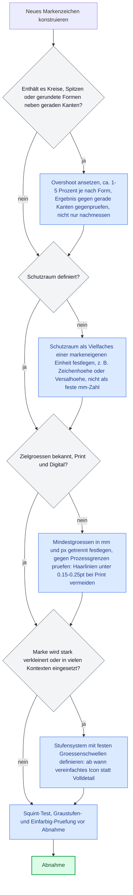

# Grundlagen des Markenhandwerks

Diese Datei übersetzt handwerkliches Wissen zur Konstruktion und Beurteilung von Logos und Markenzeichen in prüfbare Regeln für ein Sprachmodell. Sie stützt sich auf echte Markenhandbücher (Brand Portals), Fachautoritäten der Typografie, eine einschlägige Fachstudie und, wo nötig, ausdrücklich gekennzeichnete Konventionen aus der Praxis. Wo eine verbreitete Behauptung (etwa zu „Bedeutung von Formen") keine belastbare Quelle hat, steht das hier so da, nicht als stillschweigend akzeptierte Wahrheit.

## Inhalt

- 1. Konstruktion und optischer Ausgleich
- 2. Schutzraum und Lockup
- 3. Konsistenz von Strichstärke, Ecken und Punzen
- 4. Maßstabsfestigkeit
- 5. Formensprache und Gestaltgesetze
- 6. Übersetzung in Regeln
- 7. Anti-Muster
- 8. Quellen

## 1. Konstruktion und optischer Ausgleich

### Overshoot

In der Typografie bezeichnet Overshoot das Maß, um das runde oder spitze Formen (O, A) über die Grundlinie oder Versalhöhe hinausragen, damit sie neben flachen Formen (X, H) gleich groß wirken. Der Grund: Mathematisch gleich hohe Kreise und Spitzen wirken für das Auge kleiner als Formen mit flachen Kanten, weil sie die Grund- und Höhenlinie nur in einem schmalen Bereich berühren [Q1]. Wikipedia nennt als Richtwert „perhaps 1% to 3% of the cap or x-height […] typical for O" und zitiert Peter Karows Fachbuch „Digital Formats for Typefaces" (Springer, 2012, S. 26) mit konkreteren Werten: 3 % Overshoot für O, 5 % für A [Q1][Q2]. `[Spec]`

Dasselbe Prinzip gilt beim Konstruieren von Logozeichen auf einem Raster: Runde und spitze Bauteile werden bewusst leicht über die Konstruktionslinien hinausgezogen, damit sie im direkten Vergleich mit geraden Kanten gleich groß erscheinen, die Prüfung erfolgt durch Hinsehen, nicht durch Nachmessen. `[Konvention]` Q1 behandelt ausschließlich Buchstabenformen an Grund- und Versallinie und sagt zur Logokonstruktion nichts. Die Übertragung auf Zeichen auf einem Konstruktionsraster ist eine Analogie und wird hier als solche geführt, nicht als Spezifikation. Ein Fachblog (LogoGeek, als Agentur-Blog gekennzeichnet) beschreibt zusätzlich den Fall, dass Googles G-Icon in einer Korrekturversion „physically mathematically correct" gemacht wurde und dadurch laut Artikel schlechter wirkte als das ursprüngliche, optisch aber nicht geometrisch korrekte Design [Q12]. `[Konvention]`, da der Artikel dies als eigene Designer-Beobachtung ohne Beleg der Google-internen Entscheidung schildert.

### Weitere optische Korrekturen

LogoGeek beschreibt außerdem die „Irradiation"-Wirkung: Weiße Formen auf dunklem Grund wirken durch den Kontrast optisch größer als gleich große dunkle Formen auf hellem Grund, als Korrektur wird die weiße Form leicht verkleinert bzw. die schwarze leicht vergrößert [Q12]. `[Konvention]`, der Artikel selbst nennt keine Primärquelle für diese konkrete Zahl, nur das Phänomen. Der Artikel macht darüber hinaus die unbelegte Pauschalaussage, „alle großen Branding-Agenturen" würden solche Illusionen berücksichtigen, das ist eine Behauptung ohne Beleg und wird hier ausdrücklich nicht übernommen. `[Unbelegt]`

Optische statt geometrische Zentrierung (ein Icon neben einem Textblock nicht auf die mathematische Mitte, sondern auf die optische Mitte ausrichten) ist dasselbe Prinzip, das für Randausgleich im Fließtext gilt und in der Begleitdatei zur Gestaltungslehre dieses Skills bereits mit Quelle (Matthew Butterick, „Practical Typography") belegt ist. Es wird hier nicht erneut hergeleitet, sondern nur auf Logokonstruktion übertragen: Ein Kreis oder eine Spitze neben einem geraden Textblock braucht in der Regel einen kleinen Versatz, um zentriert zu wirken.

## 2. Schutzraum und Lockup

### Schutzraum als Einheit der Marke, nicht als feste Größe

Reale Markenhandbücher binden den Schutzraum (Clearspace, Exclusion Zone) fast durchgängig an ein Maß der Marke selbst, nicht an einen festen Millimeterwert:

- Die University at Buffalo definiert für ihr Hauptzeichen: „A space equal to the height of the interlocking UB should be observed around the perimeter of the mark." Für das Wappen (Crest) gilt eine andere Einheit: „A space equal to the height of the buffalo should be observed around the entire perimeter of the crest." Für Co-Branding-Fälle gilt wieder eine andere Einheit, die Breite des Zeichens [Q4]. `[Spec]` Damit zeigt eine einzelne Institution bereits, dass die Einheit je Markenelement unterschiedlich gewählt wird, das Prinzip (proportional zur Marke) bleibt aber gleich.
- Googles Android-Partnerportal definiert den Schutzraum um das Wortmarken-Lockup als Fläche, „equal to the 'o' size" aus der Wortmarke selbst, also gebunden an eine Buchstabenform innerhalb der Marke, nicht an eine externe Einheit [Q3]. `[Spec]`
- Vevo staffelt den Schutzraum nach Größe der Marke: Ab einer bestimmten Logohöhe gilt ein proportional mitwachsender Wert, für Web und Tablet zusätzlich ein Mindestwert von 20 px unabhängig von der Proportion [Q5]. `[Spec]` Das zeigt, dass ein proportionaler Schutzraum bei sehr kleinen Größen durch einen Mindestwert in Pixeln ergänzt werden kann, damit er nicht gegen null geht.

Die Regel „Schutzraum = Vielfaches einer markeneigenen Einheit (Buchstabenhöhe, Zeichenhöhe, Zeichenbreite), nicht ein absoluter mm- oder px-Wert" ist damit branchenüblich und durch mehrere unabhängige, öffentliche Markenhandbücher belegt. `[Spec]`

### Lockups

Googles Android-Richtlinien unterscheiden explizit horizontale und vertikale (gestapelte) Lockup-Varianten mit eigenen Platzierungsregeln: horizontale Lockups „can only be placed on the left or right base extremities", vertikale Lockups „can only be placed on the base extremities of the canvas, left, right or center aligned" [Q3]. `[Spec]` Die Proportion zwischen Icon und Wortmarke wird dabei nicht als freie Gestaltungsentscheidung behandelt, sondern über Schwellenwerte gesteuert (siehe Abschnitt 4, Detailabbau): Unterhalb bestimmter Größen wird eine vereinfachte Ikon-Variante zwingend vorgeschrieben, nicht die volldetaillierte [Q3]. `[Spec]`

## 3. Konsistenz von Strichstärke, Ecken und Punzen

Innerhalb einer Marke müssen Strichstärke, Eckenradien und Punzen (die von Buchstaben oder Formen eingeschlossenen Negativräume) ein konsistentes System bilden, damit Icon und Wortmarke als eine Einheit wirken; ein Bruch zeigt sich typischerweise darin, dass Icon-Strichstärke oder Eckenradius nicht zum Schriftbild passen. Für Radien speziell gibt es aus einem echten, öffentlich dokumentierten Designsystem (nicht speziell für Logos, aber mit derselben Konstruktionslogik) ein konkretes Beispiel: Microsofts Fluent-2-Designsystem legt Eckenradius-Tokens fest, die mit der Elementgröße mitskalieren: „In most cases, corner radiuses on rectangle shapes are 4 pixels by default. For shapes smaller than 32 pixels, the corner angle is reduced to 2 pixels. For large and extra-large components, 8 pixel and 12 pixel angles are used." [Q11] `[Spec]`, allerdings ausdrücklich als UI-Komponentensystem, nicht als Logo-Konstruktionsregel; die Übertragung auf Logokonstruktion (Eckenradius soll proportional zur Zeichengröße mitskalieren, nicht absolut fix bleiben) ist eine Analogieschlussfolgerung und wird hier als `[Konvention]` markiert, nicht als belegte Logo-Spezifikation.

Für Punzen (Counter Shapes) gilt die typografische Grundunterscheidung zwischen geschlossenen Punzen (vollständig umschlossen, etwa bei O) und offenen Punzen (zur Außenkante hin geöffnet, etwa bei C oder U); diese Terminologie ist typografischer Standard. Eine belastbare, quantifizierte Regel, wie eng eine Punze innerhalb einer Marke im Verhältnis zur Strichstärke mindestens sein darf, konnte in dieser Recherche nicht in einer Primärquelle gefunden werden. `[Unbelegt]`

## 4. Maßstabsfestigkeit

### Mindestgrößen

Verbreitete Blog- und Agenturquellen (u. a. logotouse.com, inkbotdesign.com, freelogoservices.com) nennen als Faustregel für Print 15 bis 25 mm Breite bei einer horizontalen Wortmarke und für Digital 24 px Höhe bei einer reinen Icon-Marke, 120 px Breite bei einem vollständigen horizontalen Lockup. Diese Werte stammen aus mehreren Agentur-Ratgebern ohne einzelne zitierfähige Autorität und werden deshalb als `[Konvention]` geführt, nicht als Spezifikation.

Belegbare, aus echten Markenhandbüchern zitierte Werte einzelner Marken:

- Google/Android: horizontales Lockup „do not make the wordmark smaller than 16px height or 0.15 in (0.4cm)", vertikales Lockup „do not make the wordmark smaller than 60px height in digital applications and 0.8in / 1.9cm in print" [Q3]. `[Spec]`
- Spotify Connect (Hardware-Partner-Logo, nicht das Hauptlogo): Mindestgröße im Druck 1,2 Zoll / 30 mm Breite, digital 130 px Breite [Q15]. `[Spec]`, ausdrücklich nur für das Connect-Kompatibilitätslogo, nicht für Spotifys Hauptmarke recherchiert.
- Vevo: minimaler Schutzraum/Anzeigewert für Web/Tablet 20 px [Q5]. `[Spec]`

Diese drei realen Beispiele liegen alle in derselben Größenordnung wie die Konventionsregel, bestätigen sie also grob, ersetzen sie aber nicht als Einzelbeleg.

### Detailabbau: konkrete Reproduktionsgrenzen

Für den Druck gibt es tatsächlich belastbare, prozessabhängige Mindest-Strichstärken, ab denen Linien in der Produktion verschwinden oder zulaufen. Eine Preflight-Fachquelle nennt folgende Tabelle für positive Linien und Negativ-/Knockout-Linien:

| Prozess | Positive Linie | Negativ-/Knockout-Linie |
|---|---|---|
| Digitaldruck (HP Indigo, Xeikon) | 0,25 pt | 0,5 pt |
| Offsetdruck | 0,15 pt | 0,25 pt |
| Flexodruck | 0,5 pt | 0,75 pt |
| Siebdruck | 1 pt | 2 pt |
| Folienprägung | 0,5 pt | 1 pt |

„A reversed or knockout line is one where ink surrounds a thin gap", solche Negativlinien brauchen durchgängig eine größere Mindeststärke als positive Linien, weil die Farbe von allen Seiten in die Lücke drängt, die Quelle spricht von „ink spread on every side“ [Q14]. `[Spec]` Für ein Logo folgt daraus praktisch: Haarlinien und enge, insbesondere negativ ausgesparte Punzen sind das Erste, was bei Verkleinerung in Richtung dieser Prozessgrenzen ausfällt, weil sie zuerst unter die jeweilige Mindeststärke fallen. Diese Schlussfolgerung ist eine direkte Ableitung aus der Tabelle, keine zusätzlich zitierte Aussage.

### Responsive und adaptive Logosysteme

Ein System, bei dem eine Marke je nach verfügbarem Raum in unterschiedliche, klar definierte Varianten wechselt (nicht nur linear skaliert), ist unter dem Begriff „Responsive Logos" bekannt. Der Designer Joe Harrison zeigt unter responsivelogos.co.uk seit 2014 eine Sammlung von Beispielen, in denen reale Logos beim Verkleinern des Browserfensters Details verlieren; die Seite beschreibt sich selbst als „an exploration into scalable logos for the modern web" und macht ausdrücklich klar, dass es sich um ein persönliches, nicht offiziell mit den gezeigten Marken abgestimmtes Projekt handelt [Q7]. `[Konvention]`, die Seite selbst nennt weder eine feste Zahl von Stufen noch konkrete Breakpoints, das populäre Konzept „Vollversion, horizontal, gestapelt, Monogramm, Icon" als feste Stufenliste konnte in dieser Recherche nicht in einer Primärquelle belegt werden und wird deshalb nicht als Spezifikation behauptet. `[Unbelegt]` für die exakte Stufenzahl.

Ein belegbares Beispiel für ein Logosystem mit klar definierten, größenabhängigen Umschaltpunkten liefert dagegen wieder Google/Android: Für das horizontale Lockup gilt „For lockups smaller than 40px height or 0.3 in (0.7cm), use the flat version" des Android-Icons, für das vertikale Lockup „After 150px height in digital and 1.5in / 3.8cm for print, you should change the Android icon's head to the flat version" [Q3]. `[Spec]` Das ist ein konkreter, zitierfähiger Beleg dafür, dass reale Markenführung Detailstufen an feste Größenschwellen bindet.

Als Sonderfall eines Markensystems, das nicht auf Verkleinerung reagiert, sondern bei gleicher Größe kontrolliert variiert: Pentagram baute für das MIT Media Lab ein generatives Zeichensystem auf Basis eines gemeinsamen Rasters. Laut Pentagrams eigener Projektbeschreibung nutzten die Gestalter „the same underlying grid as the previous logo" (ein von Richard The zum 25-jährigen Jubiläum entwickeltes Sieben-mal-sieben-Raster) und erweiterten dieses Raster auf 23 Forschungsgruppen des Labs zu „an interrelated system of glyphs" [Q8]. `[Spec]` Die genaue Regel, wie einzelne Rasterzellen bei der Generierung aktiviert werden, nennt die Quelle nicht, das wird hier entsprechend nicht behauptet. `[Unbelegt]` für die Generierungsregeln im Detail.

### Prüfverfahren

Der „Squint Test" (Augen zusammenkneifen, um die Wahrnehmung zu simulieren, wie ein Betrachter aus Distanz oder bei geringer Schärfe ein Bild liest) wird von der Nielsen Norman Group als Methode zur Prüfung visueller Hierarchie beschrieben; er zeigt, welche Elemente auch bei reduzierter Wahrnehmungsschärfe noch als dominant erkennbar sind [Q6]. `[Spec]`, NN/g ist eine anerkannte UX-Forschungsautorität, die Methode wird dort allgemein für Interfaces beschrieben, ihre Anwendung speziell auf Logoprüfung ist eine naheliegende, aber eigene Übertragung.

Dass ein Logo zusätzlich in Graustufen, als reines Schwarzweiß-Negativ/Knockout und einfarbig geprüft werden soll, ist in der Praxis breiter Konsens mehrerer Agentur- und Ratgeberquellen, ohne dass sich eine einzelne zitierfähige Norm dafür identifizieren ließ. `[Konvention]`

## 5. Formensprache und Gestaltgesetze

### Was zu geometrischen Grundformen tatsächlich belegt ist, und was nicht

In Marketing- und Agentur-Blogs kursiert eine lange Liste von Zuschreibungen: Kreise stünden für Gemeinschaft und Weichheit, Quadrate für Stabilität und Vertrauen, Dreiecke für Energie oder Männlichkeit, und so weiter. Für die meisten dieser Einzelzuschreibungen (z. B. „Quadrate wirken männlich", „Dreiecke wirken männlich") wurde in dieser Recherche keine zitierfähige Primärstudie gefunden, sie stammen ausschließlich aus Agentur-Ratgebertexten, die sich gegenseitig zitieren, nicht aus Forschung. `[Unbelegt]`

Tatsächlich belegt ist ein enger, spezifischerer Befund: Jiang, Gorn, Galli und Chattopadhyay untersuchten 2016 im „Journal of Consumer Research" (Bd. 42, Ausgabe 5, S. 709 bis 726) unter dem Titel „Does Your Company Have the Right Logo? How and Why Circular- and Angular-Logo Shapes Influence Brand Attribute Judgments", wie rundes gegenüber eckigem Logo-Zeichen Markenurteile beeinflusst. Der Kern des Befunds: Runde Formen aktivieren Assoziationen von Weichheit, eckige Formen Assoziationen von Härte, und diese Assoziationen wirken sich messbar auf nachgelagerte Urteile über Produkt- oder Markeneigenschaften aus [Q9]. `[Spec]`, allerdings ist das ein einzelner, wenn auch mehrfach zitierter Forschungsstrang zu einer engen Achse (rund/weich gegen eckig/hart), keine Bestätigung der viel breiteren Blog-Liste an Formzuschreibungen. Nachfolgende Forschung derselben Forschungslinie (u. a. Studien zu grünen Markenlogos und zu Markenerweiterungen, gefunden über ResearchGate/IDEAS-Repec-Einträge) baut auf demselben rund/eckig-Kontrast auf, wurde in dieser Recherche aber nicht im Volltext geprüft und wird deshalb nicht inhaltlich referiert. `[Unbelegt]` für die Einzelbefunde dieser Folgestudien.

### Negativraum, Figur-Grund und Gestaltgesetze

Das Interaction Design Foundation (IxDF) fasst die Gestaltgesetze mit folgenden Definitionen und Beispielen zusammen [Q10]. `[Spec]`

- Figur-Grund: Das Auge sucht zuerst eine stabile Vordergrundform; ist ein Bild nicht ausdrücklich mehrdeutig angelegt, wird die Vordergrundform zuerst erkannt.
- Geschlossenheit (Closure): „We prefer complete shapes, so we automatically fill the gaps between elements to perceive a complete image." Als Beispiele nennt IxDF unter anderem das IBM-Logo und den WWF-Panda, bei dem das Gehirn aus getrennten schwarzen Flächen eine vollständige Figur samt nicht tatsächlich gezeichneter Konturen ergänzt.
- Prägnanz (gute Form): „Pragnanz describes the human tendency to simplify complexity […] helps us see order and regularity in a world of visual competition." Als Beispiel dienen die Olympischen Ringe, die als fünf verschlungene Kreise gelesen werden, nicht als die tatsächlich gezeichneten Teilformen.
- Ähnlichkeit: Elemente mit gemeinsamen Oberflächenmerkmalen werden als Gruppe wahrgenommen.
- Nähe: Näher beieinanderliegende Elemente werden als zusammengehörig gelesen, als Beispiel nennt IxDF das Girl-Scouts-Logo mit drei eng gruppierten Profilgesichtern.

Für den FedEx-Pfeil im Negativraum zwischen „E" und „x" sowie für den WWF-Panda als Lehrbuchbeispiel für Geschlossenheit finden sich dieselben Beispiele durchgängig auch in mehreren Fachartikeln zu Gestaltpsychologie in der Logogestaltung (u. a. Smashing Magazine, LogoGeek); die konkrete Entstehungsgeschichte des FedEx-Pfeils selbst (dass der Designer gezielt so lange experimentierte, bis die Buchstaben eng genug beieinanderstanden, dass ein Pfeil entstand) wird in mehreren dieser Sekundärquellen gleich beschrieben, konnte in dieser Recherche aber nicht gegen eine Primärquelle des Designers geprüft werden. `[Konvention]` für die Entstehungsgeschichte, `[Spec]` für die reine Wahrnehmungsbeschreibung über IxDF.

Winkel, Krümmung und Symmetrie als eigenständige, von den obigen Formzuschreibungen unabhängige Bedeutungsträger (etwa „scharfe Winkel wirken aggressiv") ließen sich in dieser Recherche nicht auf eine eigene, von der Kreis/Eckig-Studie unabhängige Quelle zurückführen; solche Aussagen fallen inhaltlich unter dieselbe Kritik wie die Formzuschreibungen oben. `[Unbelegt]`

## 6. Übersetzung in Regeln

Aus den Abschnitten 1 bis 5 lassen sich folgende prüfbare Regeln ableiten:

1. Kreise, Spitzen und gerundete Formen neben geraden Kanten bekommen Overshoot, keine mathematisch identische Höhe oder Breite. Die Richtwerte 1 bis 3 % für runde und 5 % für spitze Formen sind für Schriftzeichen belegt `[Spec]` [Q1][Q2], ihre Übertragung auf Logozeichen ist Handwerkskonvention `[Konvention]`. Feinjustierung durch Hinsehen, nicht nur durch Messen.
2. Der Schutzraum wird als Vielfaches einer markeneigenen Einheit definiert (Buchstabenhöhe, Zeichenhöhe oder -breite), nicht als feste Millimeter- oder Pixelzahl `[Spec]` [Q3][Q4][Q5]. Bei sehr kleinen Anzeigegrößen zusätzlich einen absoluten Pixel-Mindestwert setzen, damit der proportionale Wert nicht gegen null läuft `[Spec]` [Q5].
3. Horizontale und gestapelte Lockups sind eigene, fest definierte Varianten mit eigenen Platzierungs- und Proportionsregeln, keine freie Neuanordnung derselben Teile `[Spec]` [Q3].
4. Mindestgrößen werden getrennt für Print (mm) und Digital (px) dokumentiert, nicht als ein einziger Wert `[Konvention]`, Belegt sind einzelne reale Ankerwerte, keine Spanne: Google/Android nennt für die horizontale Wortmarke 16 px beziehungsweise 4 mm `[Spec]` [Q3], Spotify nennt für das Connect-Kompatibilitätszeichen 130 px beziehungsweise 30 mm `[Spec]` [Q15]. Die kursierende Faustregel von etwa 15 bis 25 mm für ein horizontales Lockup stammt aus Agenturquellen und nicht aus diesen Markenhandbüchern `[Konvention]`. Q5 (Vevo, 20 px) ist ein Schutzraumwert und kein Logogrößenwert, er gehört nicht hierher.
5. Strichstärken, insbesondere negativ ausgesparte (Knockout-)Linien, dürfen die prozessabhängige Mindeststärke nicht unterschreiten (Richtwerte 0,15 bis 1 pt positiv, 0,25 bis 2 pt Knockout je nach Druckverfahren) `[Spec]` [Q14].
6. Ab dokumentierten Größenschwellen wechselt die Marke kontrolliert auf eine vereinfachte Stufe (z. B. reduziertes Icon statt Volldetail), diese Schwellen werden als konkrete px/mm-Werte festgehalten, nicht dem Zufall überlassen `[Spec]` [Q3].
7. Vor Abnahme wird die Marke im Squint-Test, in Graustufen, als Schwarzweiß-Negativ/Knockout und einfarbig geprüft `[Spec]`/`[Konvention]` [Q6].
8. Eckenradien und Strichstärken skalieren proportional mit der Elementgröße statt fix zu bleiben, analog zu dokumentierten UI-Designsystemen `[Konvention]` [Q11].
9. Aussagen der Form „diese geometrische Form bedeutet X" werden nicht als allgemeingültig behandelt. Belegt ist ausschließlich der enge Kontrast rund/weich gegen eckig/hart aus einer einzelnen, mehrfach zitierten Studie `[Spec]` [Q9], alles darüber hinaus ist unbelegte Branchenfolklore `[Unbelegt]`.
10. Negativraum wird als vollwertiges Gestaltungsmittel behandelt (Geschlossenheit, Figur-Grund), nicht als Restfläche `[Spec]` [Q10].

## 7. Anti-Muster

- Schutzraum als feste Millimeterzahl statt als Vielfaches einer markeneigenen Einheit festlegen, dadurch bricht die Proportion bei jeder Skalierung.
- Kreise und Spitzen mathematisch exakt auf dieselbe Höhe wie gerade Kanten bringen und sich wundern, warum sie kleiner wirken, statt Overshoot anzusetzen [Q1], Übertragung aus der Typografie, siehe Abschnitt 1.
- Ein einziges Mindestmaß für Print und Digital verwenden, statt beide getrennt zu dokumentieren.
- Haarlinien oder enge Knockout-Punzen einsetzen, ohne die Mindeststärke des Zielprozesses zu kennen [Q14].
- Ein „responsives" Logo behaupten, ohne dokumentierte Größenschwellen zu haben, an denen sich das Zeichen tatsächlich ändert [Q3][Q7].
- Icon und Wortmarke mit unterschiedlicher, nicht abgestimmter Strichstärke oder Eckenradius kombinieren.
- Eine Formbedeutung (Kreis = X, Dreieck = Y) als feststehende Tatsache behaupten, obwohl dafür außerhalb der schmalen rund/eckig-Studie keine Quelle existiert [Q9].
- Die Marke nur in Vollfarbe auf weißem Grund prüfen und nie im Knockout, in Graustufen oder in der tatsächlichen Zielgröße [Q6].
- Lockup-Proportionen (Verhältnis Icon zu Wortmarke) bei jeder neuen Anwendung neu „nach Auge" festlegen statt einer festen, dokumentierten Regel zu folgen [Q3].

## 8. Quellen

| Nr | Quelle | URL | abgerufen | was daraus stammt |
|---|---|---|---|---|
| Q1 | Wikipedia, „Overshoot (typography)" | https://en.wikipedia.org/wiki/Overshoot_(typography) | 2026-09-08 | Definition Overshoot, Richtwert 1-3 % für O, Zitat von Karow |
| Q2 | Peter Karow, „Digital Formats for Typefaces", Springer 2012, S. 26 (zitiert nach Q1) | (über Q1 referenziert) | 2026-09-08 | konkrete Overshoot-Werte 3 % (O) / 5 % (A) |
| Q3 | Google, Partner Marketing Hub, Android Brand, „Logo lock-ups" | https://partnermarketinghub.withgoogle.com/brands/android/visual-identity/visual-identity/logo-lock-ups/ | 2026-09-08 | Mindestgrößen (px/in/cm), Schutzraum-Einheit „o size", Größenschwellen für vereinfachtes Icon, Lockup-Platzierungsregeln |
| Q4 | University at Buffalo, „Clear Space" | https://www.buffalo.edu/brand/identity/usage/Clear-space.html | 2026-09-08 | Schutzraum gebunden an Höhe/Breite unterschiedlicher Markenelemente |
| Q5 | Vevo Brand Guidelines, „Logo – Clearspace" | https://brand.vevo.com/logo/clearspace/ | 2026-09-08 | gestaffelter Schutzraum nach Logogröße, Mindestwert 20 px Web/Tablet |
| Q6 | Nielsen Norman Group, „Squint Test" (Video-Beschreibung) | https://www.nngroup.com/videos/squint-test/ | 2026-09-08 | Zweck und Funktion des Squint-Tests für visuelle Hierarchie |
| Q7 | Joe Harrison, „Responsive Logos" | https://www.responsivelogos.co.uk/ | 2026-09-08 | Konzept skalierender/adaptiver Logos, Selbstbeschreibung als unabhängiges Showcase |
| Q8 | Pentagram, „MIT Media Lab, Story" | https://www.pentagram.com/work/mit-media-lab/story | 2026-09-08 | generatives Rastersystem (7x7-Grundraster), Erweiterung auf 23 Forschungsgruppen |
| Q9 | Jiang, Gorn, Galli, Chattopadhyay (2016), „Does Your Company Have the Right Logo? How and Why Circular- and Angular-Logo Shapes Influence Brand Attribute Judgments", Journal of Consumer Research 42(5), S. 709-726 | https://www.semanticscholar.org/paper/9cb1bc27782f497d1f0c5d201576cb8d96756aff | 2026-09-08 | einziger belegter Befund zu Formbedeutung: rund = Weichheits-, eckig = Härteassoziation, Wirkung auf Markenurteile |
| Q10 | Interaction Design Foundation, „What are the Gestalt Principles?" | https://ixdf.org/literature/topics/gestalt-principles | 2026-09-08 | Definitionen Figur-Grund, Geschlossenheit, Prägnanz, Ähnlichkeit, Nähe, Logo-Beispiele (IBM, WWF, Olympische Ringe, Girl Scouts) |
| Q11 | Microsoft, Fluent 2 Design System, „Shapes" | https://fluent2.microsoft.design/shapes | 2026-09-08 | Eckenradius-Tokens und größenabhängige Skalierungsregel (UI-System, per Analogie auf Logos übertragen) |
| Q12 | LogoGeek, „Optical corrections every logo designer should know about" | https://logogeek.uk/logo-design/optical-corrections/ | 2026-09-08 | Beschreibung Overshoot und Irradiation-Effekt, Google-G-Beispiel, als Agentur-Blog gekennzeichnet |
| Q14 | Preflight.art, Glossareintrag „Hairline" | https://preflight.art/glossary/hairline | 2026-09-08 | Tabelle Mindest-Strichstärken je Druckprozess, positiv und Knockout |
| Q15 | Spotify Developer, „Spotify Connect Logo Guidelines" (PDF) | https://developer.spotify.com/legal/hardware-partners/spotify-connect-logo-guidelines.pdf | 2026-09-08 | Mindestgröße Connect-Logo: 30 mm Print, 130 px Digital, Schutzraum 1/5 der Logohöhe |
